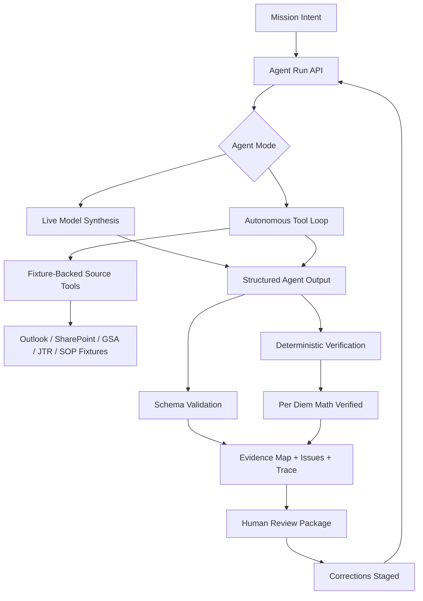

# FieldDesk

**Less admin. More mission.**

FieldDesk turns fragmented military admin work into mission-ready action packages: source-backed, gap-checked, audit-logged, and ready for human review.

FieldDesk is an agent-first workflow prototype for administrative readiness. A junior NCO starts with plain-language mission intent; FieldDesk searches controlled source artifacts, extracts structured facts, surfaces missing or conflicting evidence, verifies deterministic math, and produces a review-ready packet.

> Demo environment: all data is synthetic. FieldDesk does not approve travel, submit DTS, or replace human review.

## Demo


## What It Does

- Captures mission intent in natural language.
- Searches mocked Outlook, SharePoint, GSA, JTR, Unit Checklist, Local SOP, and uploaded correction artifacts.
- Extracts structured trip facts: destination, dates, traveler count, and supporting evidence.
- Builds an evidence map with source citations and reviewer-facing gaps.
- Uses deterministic rules for per diem math instead of asking the LLM to calculate.
- Tracks correction state and recomputes readiness after staged evidence.
- Produces a DTS-style export draft and final review package.

## Architecture



## Agent Boundary

The model owns semantic work:

- interpreting mission intent
- extracting facts
- reasoning over available artifacts
- identifying gaps and conflicts
- drafting reviewer objections and actions

The application owns deterministic controls:

- source availability
- correction state
- schema validation
- per diem arithmetic
- audit trace
- final API contract

## Running Locally

```bash
npm install
npm run dev -- --hostname localhost
```

Open `http://localhost:3000`.

For live model runs, configure `.env` locally:

```bash
FIELD_DESK_AGENT_MODE=openai
OPENROUTER_MODEL=google/gemini-3-flash-preview
OPENROUTER_API_KEY=...
```

Use `FIELD_DESK_AGENT_MODE=tool-loop` to run the bounded autonomous agent path. In that mode the model selects one tool call at a time, the API validates and executes fixture-backed tools, and the final packet still passes the same schema and deterministic math checks.

Do not commit `.env`.

## Verification

```bash
npm run lint
npm run build
npm run test:api
npm run test:route
npm run test:rules
npm run test:tools
npm run test:tool-loop
npm run test:e2e
npm run eval:mock
npm run eval:openrouter
npm run eval:tool-loop
```

## Scope

The MVP intentionally mocks real integrations. Outlook, SharePoint, GSA, DTS, auth, RBAC, durable persistence, and real connector permissions are deferred until after the demo.
