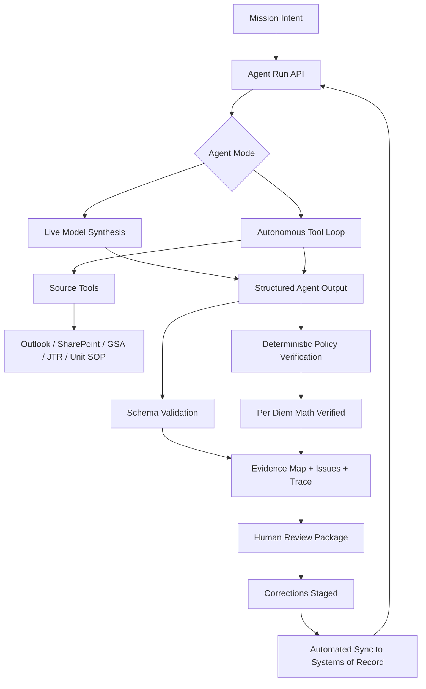

# FieldDesk

**Less admin. More mission.**

The military does not just run on orders. It runs on the administrative work that makes orders executable.

## Submission

- **Team name:** FieldDesk
- **Track:** GenAI.mil
- **What we built:** FieldDesk is an agentic workflow platform that consolidates fragmented information, reasons across sources against policy, catches gaps before review, and prepares ready-to-route action packages for human approval. TDY is the first workflow, but the platform is built so units can create workflow templates, reuse them, and share them across the formation.

## Why It Matters

The US military runs on paperwork. Modern defense often focuses on the digital battlefield, but for millions of service members the daily friction is in the administrative trenches: policies, forms, rosters, approvals, checklists, rate tables, and routing rules.

The failure mode is familiar: the packet comes back, the NCO fixes one issue, then another issue appears. FieldDesk attacks that loop by finding the evidence, surfacing the gaps, and preparing the work before it reaches a reviewer.

**Core value moment:** FieldDesk catches avoidable administrative failure before review.

FieldDesk is not a regulation chatbot. It is an agentic workflow platform for administrative readiness.

## SCSP Hackathon - Why FieldDesk

- **Novelty:** FieldDesk is not a regulation chatbot, form filler, or static checklist. It is an agentic workflow platform for administrative readiness that turns scattered admin context into ready-to-route work.
- **Technical difficulty:** The demo combines agent runtime with tool calling, mocked enterprise connectors, document/email understanding, evidence mapping, conflict detection, deterministic calculations, policy-level citations, structured outputs, and LLM-as-judge evals.
- **National impact:** FieldDesk directly targets the bureaucratic tail that keeps warfighters behind desks instead of in the field. TDY is the wedge, but the platform pattern applies to leave, supply, maintenance, range requests, training approvals, personnel actions, deployment paperwork, housing, awards, and evaluations.
- **Problem-solution fit:** Junior NCOs do not need another search box. They need a system that turns scattered evidence into a route-ready packet: what matters, what is missing, what will get returned, and what action to take next.

## Demo


### The Workflow

We started with **TDY** because it is concrete, common, and painful.

A junior NCO enters:

> Send 10 soldiers to Demo Training Site for training from June 10-14. Lodging and rental vehicles required.

FieldDesk Agent searches across diverse sources and finds the training order, roster, approval email, GSA per diem rates, JTR references, unit checklist, and local SOP. It also catches the problems that would likely cause a return:

- The mission and training order say 10 travelers, but the roster only shows 8.
- No funding memo or fund cite is present.
- The rental vehicle justification is too generic for review.

The user stages corrections: corrected roster, funding memo, and mission-specific rental vehicle justification. FieldDesk recomputes readiness and generates the review package: evidence map, reviewer objections, action list, packet summary, DTS-style export rows, and source-backed audit trail.

## Agentic Platform

The repeatable pattern is:

1. Capture intent.
2. Search fragmented sources.
3. Reason across evidence against policy.
4. Surface gaps, conflicts, and reviewer objections.
5. Produce ready-to-route work for human review.

- **Template-driven:** Start from TDY, leave, range, maintenance, supply, awards, evaluations, housing, or deployment workflows.
- **Adaptable:** Encodes local SOPs, unit checklists, source systems, required artifacts, and routing risks.
- **Disconnected-ready:** Runs against controlled context, cached docs, exported inboxes, offline policy packs, and approved local models.
- **Shareable:** Turns a strong admin process into a reusable playbook for the formation.
- **Department-scale:** TDY is the wedge; the same pattern can expand across the administrative surface of the force.

This local/offline-first posture shaped the design: FieldDesk uses explicit source tools instead of open web search, validates structured outputs, keeps deterministic math outside the model, treats source availability as a product boundary, and can swap live integrations for local fixtures or cached system exports.

## Datasets And APIs

FieldDesk uses synthetic data to mock the systems a real deployment would connect to. This keeps the hackathon demo public-demo safe and shareable, and fast while still showing the product motion across the real admin surface area.

- **Outlook:** mocked approval emails, reviewer notes, funding threads, and coordination messages.
- **SharePoint:** mocked training orders, rosters, unit checklists, prior packet files, and corrected uploads.
- **GSA:** mocked per diem rate data used by a deterministic rules engine for lodging and M&IE estimates.
- **DTS:** mocked DTS-style export fields showing how verified trip facts, funding evidence, per diem, and justifications would flow into an authorization packet.
- **JTR:** mocked travel policy excerpts used to ground reviewer-facing issues and references.
- **Local SOP / Unit Checklist:** mocked unit routing expectations and packet completeness requirements.
- **Uploaded files:** mocked corrected roster and funding memo artifacts staged by the user during the correction flow.

The MVP intentionally mocks connectors instead of requiring live Outlook, SharePoint, GSA, or DTS access. The point is to prove the workflow: agent-led evidence gathering, gap detection, correction, and review-ready output.

## Architecture



## Agent Boundary

The model owns semantic work:

- interpreting mission intent
- selecting tools and source searches
- extracting facts from evidence
- reasoning over available artifacts
- identifying gaps and conflicts
- drafting reviewer objections and actions

The application owns deterministic controls:

- source availability
- correction state
- schema validation
- per diem arithmetic
- audit trace
- final API contract

Those boundaries are intentional for deployed military environments. The model reasons over the packet, but the platform controls what data is available, what tools can run, what math is trusted, and what gets synced back to systems of record.

## How To Run It

```bash
npm install
npm run dev -- --port 3000
```

Open `http://localhost:3000`.

By default, the app can run with static/mock data. For live model runs, configure `.env` locally:

```bash
FIELD_DESK_AGENT_MODE=tool-loop
OPENROUTER_MODEL=google/gemini-3-flash-preview
OPENROUTER_API_KEY=...
```

OpenRouter is used for hackathon convenience. The agent runtime is designed so the model endpoint can be swapped for GenAI.mil or an approved local/offline model in a disconnected or secure environment.

Use `FIELD_DESK_AGENT_MODE=tool-loop` to run the autonomous agent path. In that mode the model plans tool calls, the API executes fixture-backed source tools, deterministic rules verify per diem math, and the final packet passes schema checks.

Do not commit `.env`.

## Verification

```bash
npm run lint
npm run build
npm run test:api
npm run test:route
npm run test:rules
npm run test:tools
npm run test:tool-loop
npm run test:e2e
npm run eval:mock
npm run eval:openrouter
npm run eval:tool-loop
```

The live `tool-loop` eval uses the agent path plus an LLM judge to evaluate semantic correctness instead of brittle row-name matching.

## Scope

The MVP intentionally does not build real Outlook OAuth, live SharePoint permissions, DTS submission, travel booking, voucher reimbursement, approval routing, RBAC, durable persistence, classified-data handling, or a full workflow-template marketplace.
